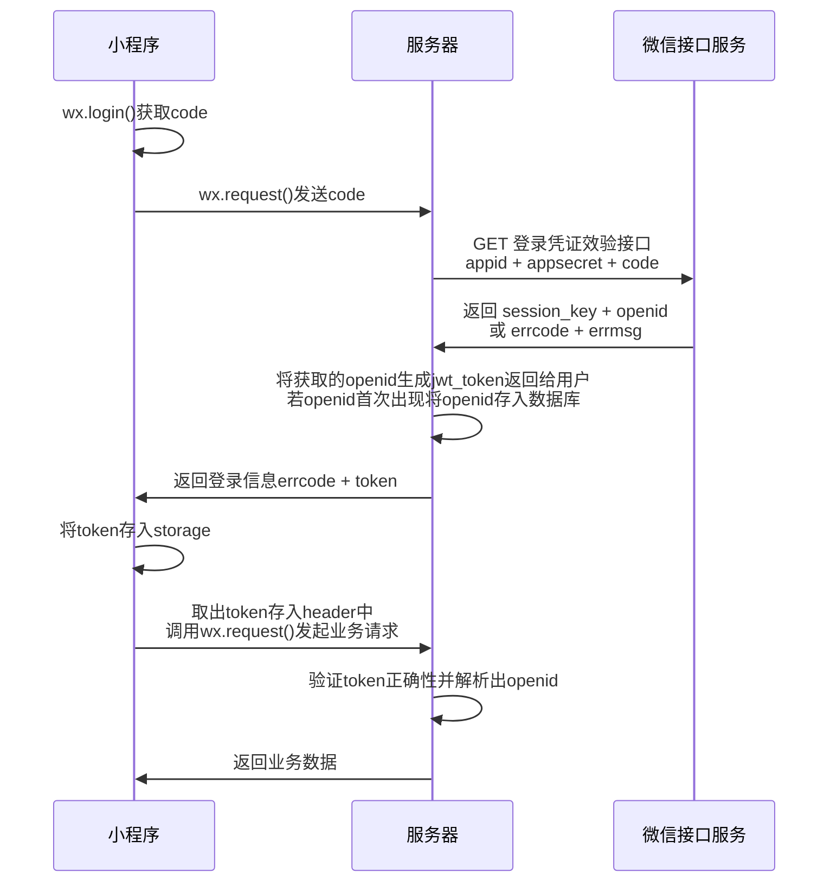

<h1><center>详细设计文档</center></h1>


## 📚︎1. 概述

#### 1.1 范围

​	本文档主要是对项目 **[闲置土地共享]** 的相关需求的详细分析与设计, 但**仅对后端服务器**给出具体的算法与结构设计, 对小程序方面只给出部分要求与规范以及指导建议。

#### 1.2 包含

- [x] 🌊按流程的详解步骤
- [x] 🐬数据库设计与使用
- [x] 👨‍🔧接口的设计与使用例

#### 1.3 设计结构

​	本文将以**每个待实现功能**为基本模块进行编写, 详细分析功能并给出相关解决方案, 解决方案中部分将包含前端和后端所需要完成的工作

## ⚙️2. 功能列表

- 账号登录体系

## 3. 功能详细设计

#### 3.1 账号登录系统

> 小程序中账号登录将采用微信官方提供的登录相关接口

- 在本系统中, 将以如下方式实现



- 说明

  - 小程序:

    在用户进入小程序时, 可展现一个登录界面, 点击登录按钮调用**login函数**,

    该**login函数**:

    ​	首先调用 `wx.login()`, 获取到`code`字段, 将code字段向服务器发送一个**GET-Request**[/api/login](#login)

    ​	errcode -> 0:	告知用户登录成功, 将取得的`token`存入本地storage, 以待后续业务请求, 跳转到主界面

    ​	errcode -> !0:   告知用户登录错误, 显示错误原因

  - 服务器:

    在接受到上述接口传来的js_code后,向微信后台发起请求[auth.code2Session](https://developers.weixin.qq.com/miniprogram/dev/api-backend/open-api/login/auth.code2Session.html), 将数据处理为上述接口所需数据形式返回。`errcode`, `errmsg`继承微信后台获取到的数据, `token`由jwt工具生成, 有效时间暂定为7day。

    同时, 判断获取到的`openid`(作为用户ID)是否已经在数据库存在, 否则添加进数据库[USER表](#5.1 USER表)

## 4.API接口说明

#### login
[/api/login](https://www.eolink.com/share/project/api/detail?groupID=-1&apiID=48000826&shareCode=36iWep&shareToken=$2y$10$UrwSpCNcoPLs9YAUDSpDae4HoEBmekVFlA~2FKmLaQ~2FXF.KJjpHZ56C&shareID=375768)[^1]

## 5.数据库说明

#### 5.1 USER表

| UID  | OPENID |
| ---- | ------ |
|      |        |

```sql
CREATE TABLE USER(
	UID INT UNSIGNED NOT NULL AUTO_INCREMENT PRIMARY KEY,
    OPENID VARCHAR(128) NOT NULL UNIQUE
)
```

