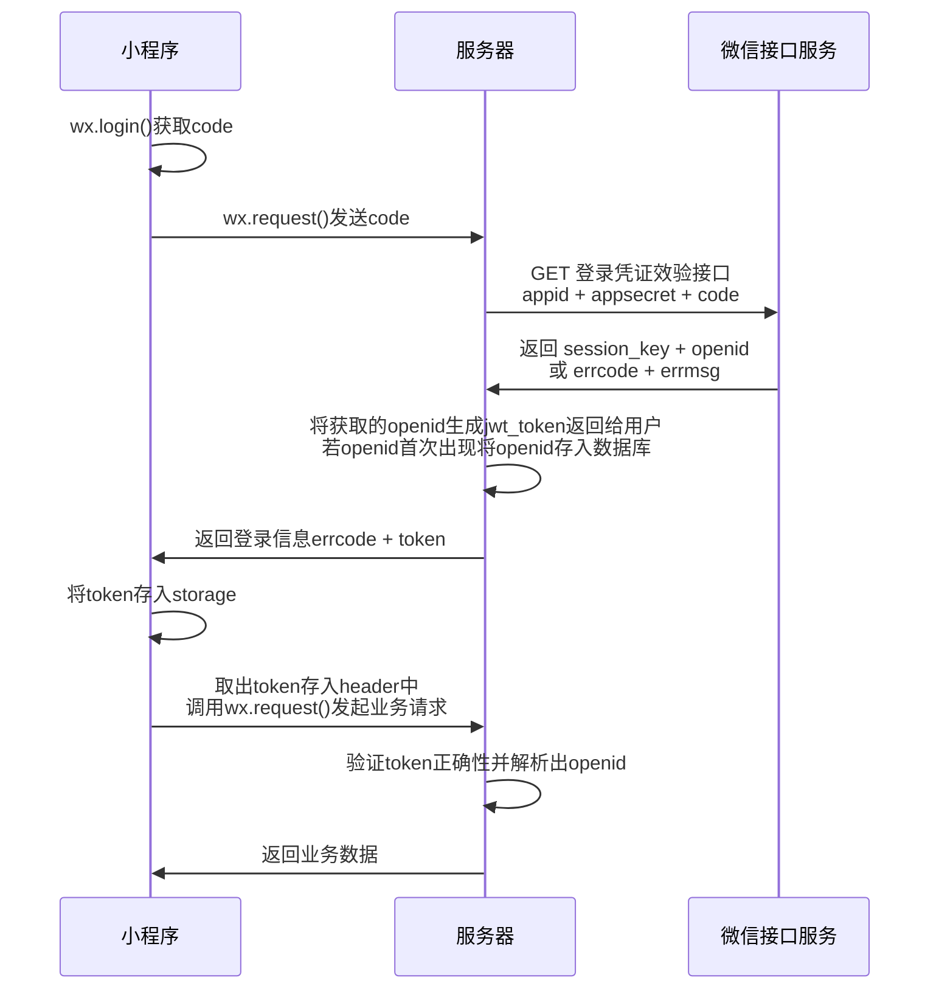
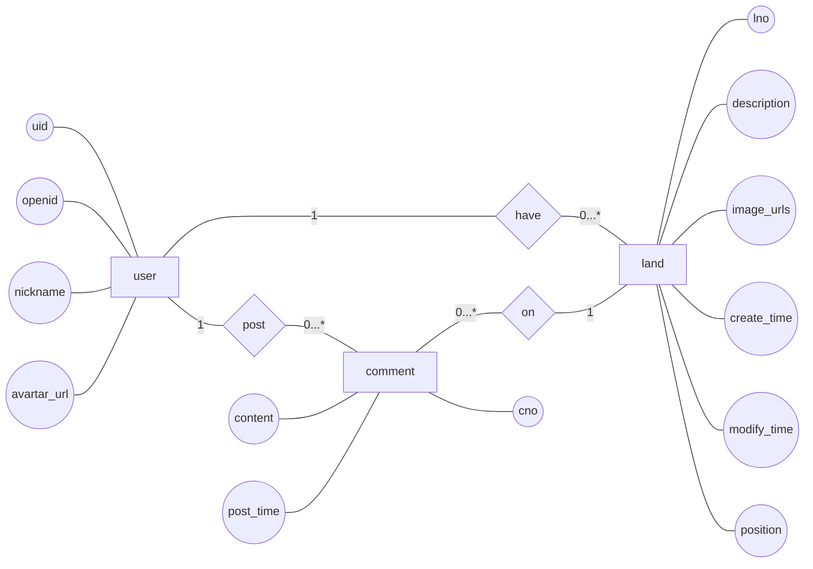
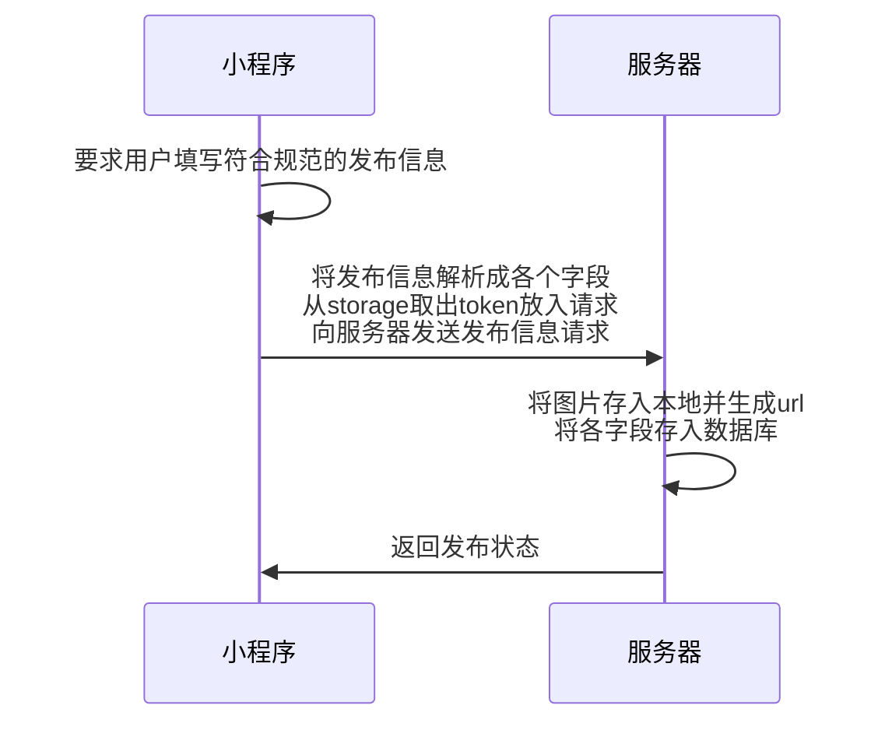

<h1><div style="text-align: center;">详细设计文档</div></h1>

## 📚︎1. 概述

#### 1.1 范围

本文档主要是对项目 **[闲置土地共享]** 的相关需求的详细分析与设计, 但**仅对后端服务器**给出具体的算法与结构设计, 对小程序方面只给出部分要求与规范以及指导建议。

#### 1.2 包含

- [x] 🌊按流程的详解步骤
- [x] 🐬数据库设计与使用
- [x] 👨‍🔧接口的设计与使用例

#### 1.3 设计结构

本文将以 **每个待实现功能** 为基本模块进行编写,

详细分析 功能 并给出 解决方案, 解决方案中部分将包含 前端 和 后端 工作

## ⚙️2. 功能列表

- [账号登录系统](#31-账号登录系统)
- [闲置土地信息管理](#32-闲置土地信息管理)

## 3. 功能详细设计

#### 3.1 账号登录系统

小程序中账号登录将采用微信官方提供的登录相关接口

在本系统中, 将以如下方式实现



说明

- **小程序**:

   在用户进入小程序时, 可展现一个登录界面, 点击登录按钮调用 **login函数**,

   该**login函数**:

   首先调用 `wx.login()`, 获取到`code`字段, 将`code`
  字段通过 [/api/user/login](https://www.eolink.com/share/project/api/detail?groupID=-1&apiID=48000826&shareCode=36iWep&shareToken=$2y$10$UrwSpCNcoPLs9YAUDSpDae4HoEBmekVFlA~2FKmLaQ~2FXF.KJjpHZ56C&shareID=375768))请求发送到服务器

   返回体中:

   errcode -> 0:    告知用户登录成功, 将取得的`token`存入本地storage, 以待后续业务请求, 跳转到主界面

   errcode -> !0:   告知用户登录错误, 显示错误原因

- **服务器**:

  
  在接受到上述接口传来的js_code后,向微信后台发起请求[auth.code2Session](https://developers.weixin.qq.com/miniprogram/dev/api-backend/open-api/login/auth.code2Session.html)
  , 将数据处理为上述接口所需数据形式返回。

   其中`errcode`, `errmsg`继承微信后台获取到的数据, `token`由jwt工具生成, 有效时间暂定为 7 day。

   同时, 判断获取到的`openid`(作为用户ID)是否已经在数据库存在,

   存在:    更新`nickname`,`avatarurl`

   不存在:新插入一行用户数据

***!!!记住此后的请求都要在请求头中加Token鉴权!!! 字段就命名为 'Token'***


#### 3.2 闲置土地信息管理

用户所拥有的核心功能是能够发布、删除、修改闲置土地信息

我们拥有闲置土地这一个实体对象，联合用户、评论对象有以下实体关系模型



由此得到[数据库结构](#5数据库说明), 在表结构创建的comment里有各个字段的解释信息

现在我们定义用户 **发布土地流程**:



说明:

- **小程序**:

  用户点击一个发布土地按钮, 进入土地信息填写界面, 该界面应该有

    - **填写土地描述**: 填写文本信息的土地详情描述
    - **选择描述图片**: 选择图片信息
    - **选择地理位置**: 调用地图接口选择地理位置获取经纬度

  将土地描述存入`content`,经纬度按 字符串`'$经度;$维度'`的格式存入`position`

  点击提交按钮后

   首先
  将图片通过 [/api/upload/image](https://www.eolink.com/share/project/api/detail?groupID=-1&apiID=48001523&shareCode=36iWep&shareToken=$2y$10$gmvhiBI~2FqTO49lheilQUkevbipzQ~2Fvc8u3A4Z4eeyjCjIF2u4UOXq&shareID=375768)上传到服务器

   然后 将其他信息通过 [/api/post/land]() 上传到服务器


- **服务器**:


## 4.API汇总

​    [/api/user/login](https://www.eolink.com/share/project/api/detail?groupID=-1&apiID=48000826&shareCode=36iWep&shareToken=$2y$10$UrwSpCNcoPLs9YAUDSpDae4HoEBmekVFlA~2FKmLaQ~2FXF.KJjpHZ56C&shareID=375768)

​    [/api/upload/image](https://www.eolink.com/share/project/api/detail?groupID=-1&apiID=48001523&shareCode=36iWep&shareToken=$2y$10$gmvhiBI~2FqTO49lheilQUkevbipzQ~2Fvc8u3A4Z4eeyjCjIF2u4UOXq&shareID=375768)


## 5.数据库说明

#### 5.1 USER表

| uid | openid | nickname | avatar_url |
|-----|--------|----------|------------|
|     |        |          |            |

```sql
CREATE TABLE User
(
    uid        INT AUTO_INCREMENT PRIMARY KEY COMMENT '序号',
    openid     VARCHAR(128) NOT NULL UNIQUE COMMENT '小程序开放ID',
    nickname   VARCHAR(128) COMMENT '微信昵称',
    avatar_url VARCHAR(128) COMMENT '微信头像链接'
);
```

#### 5.2 LAND表

| lno | description | image_urls | uid | create_time | modify_time | position |
|-----|-------------|------------|-----|-------------|-------------|----------|
|     |             |            |     |             |             |          |

```mysql
create table Land
(
    lno         int auto_increment primary key comment '序号',
    description varchar(255) not null comment '描述',
    image_urls  varchar(255) comment '描述图标链接 以;作为分割符',
    uid         int comment '发布的用户序号',
    position    varchar(64)  not null comment '经纬度 例子 127.2131231;67.1312332',
    create_time datetime     not null comment '创建时间',
    modify_time datetime comment '修改时间',
    foreign key (uid) references User (uid)
)
```

#### 5.3 COMMENT表

| cno | uid | content | lno | post_time |
|-----|-----|---------|-----|-----------|
|     |     |         |     |           |

```sql
create table Comment
(
    cno       int unsigned auto_increment primary key comment '序号',
    uid       int          not null comment '留言的用户序号',
    content   varchar(255) not null comment '留言内容',
    lno       int          not null comment '留言的土地序号',
    post_time datetime     not null comment '留言时间',
    foreign key (uid) references User (uid),
    foreign key (lno) references Land (lno)
)
```
